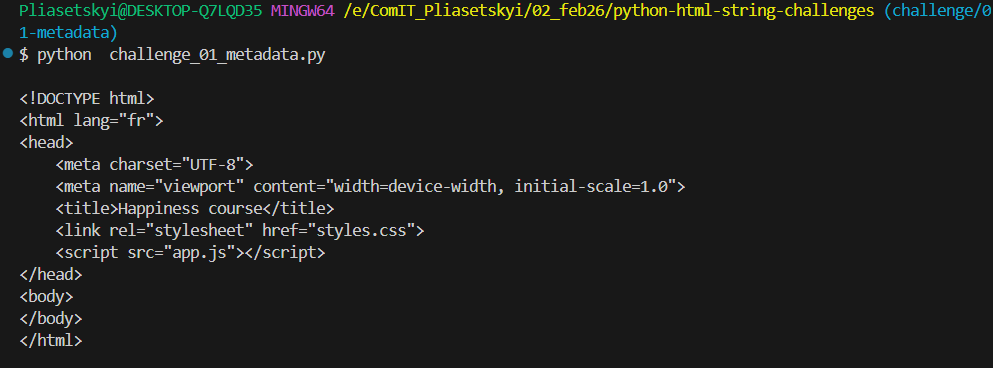

# Python HTML String Manipulation Challenges

5 Python challenges to build and modify a minimal HTML page using string methods
and concatenation only. No parsers, no libraries — pure string primitives.

## Rules
- Only string methods (.replace, .find, .rfind, .split, .index, .count, etc.) are allowed
- String concatenation with + and += is allowed
- f-strings may be used to build values before insertion
- Converting the string to a list to index elements is NOT allowed
- No imports or external libraries of any kind

## Challenges

| # | Challenge | Branch | Status |
|---|-----------|--------|--------|
| 1 | Update Page Metadata | `challenge/01-metadata` | ✅ Done |
| 2 | Update Stylesheet and Script Sources | `challenge/02-assets` | ⏳ Pending |
| 3 | Inject Heading Tags | `challenge/03-headings` | ⏳ Pending |
| 4 | Add Paragraph and Image Tags | `challenge/04-content` | ⏳ Pending |
| 5 | Full Page Builder | `challenge/05-full-page` | ⏳ Pending |

## Outputs

### Challenge 1 — Update Page Metadata

**Concepts:** `.replace()`, f-strings, string concatenation

**Solution file:** `challenge_01_metadata.py`

**HTML output file:** `html_outputs/challenge_01_output.html`

**Terminal output:**

**Browser preview:** Open `html_outputs/challenge_01_output.html` in a browser to verify
the updated `lang` attribute and `<title>` tag render correctly.
